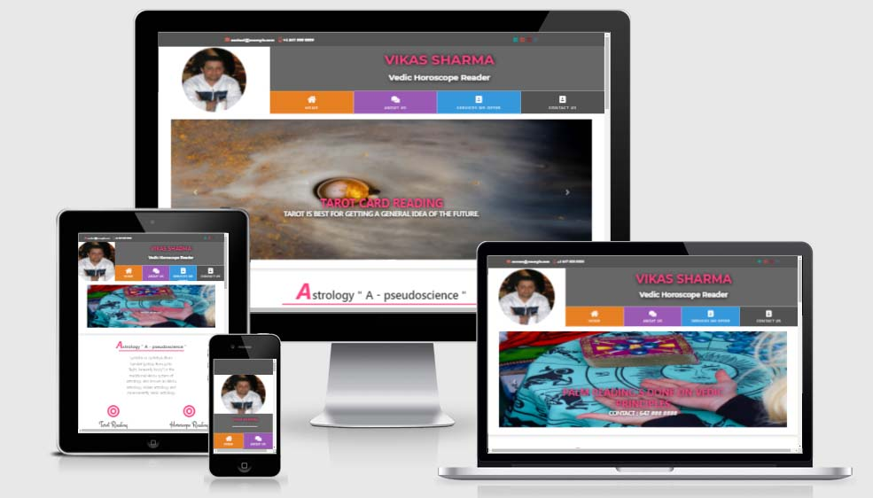

## Astrological website Developed Using Bootstrap Framework
 

    

<h3 align="center">
        <a href="https://vikasinder.github.io/astrovikas/">Click Here For Preview</a>
</h3>
  

## Astrological Site

* This Is My  First Complete User Centric Front End Development project Developed using Bootstrap Framework ( Mobile First Devlopment ) Made Under The Guidance Of My Mentor ( Mr.Anmar Jarjess ) . 

### Built Using

* [Bootstrap 4.6](https://getbootstrap.com)
* [CSS3](https://www.w3schools.com/css/)
* [HTML5](https://www.w3schools.com/html/)
* [GoogleFonts](https://fonts.google.com/)
* [FontAwesome](https://www.bootstrapcdn.com/fontawesome/)

## Structure Of Contents:-

* index.html
* Contact.html
* Services.html
* Aboutus.html
* assets
    * images
    * css
       * styles.css

## Existing Features

### Description Of Pages:-

#### Index.html 

1. Header Section
    * Top Bar ( Consists of Contact and social icons )
    * logo Image 
    * Menu Icons
2. Crousel 
3. What Astrology All About
4. Various Forms of Astrological Studies
    * Tarot Readings
    * Horoscope Readings
    * Vastu Readings
5. Know Us Section
6. What Stars Holds For You
7. Advertisement section 
8. Social Contact links section 
    * facebook
    * Instagram
    * Youtube
    * Twitter
9. Footer

#### Contact.html 

1. Header Section
    * Top Bar ( Consists of Contact and social icons )
    * logo Image 
    * Menu Icons
2. Crousel 
3. Contact Us Form
4. Know Us Section
5. What Stars Holds For You
7. Advertisement section 
8. Social Contact links section 
    * facebook
    * Instagram
    * Youtube
    * Twitter
9. Footer

#### AboutUs.html 

1. Header Section
    * Top Bar ( Consists of Contact and social icons )
    * logo Image 
    * Menu Icons
2. Crousel 
3. About Me Section
4. Know Us Section
5. What Stars Holds For You
6. Advertisement section 
7. Social Contact links section 
    * facebook
    * Instagram
    * Youtube
    * Twitter
8. Footer

#### Services.html 

1. Header Section
    * Top Bar ( Consists of Contact and social icons )
    * logo Image 
    * Menu Icons
2. Crousel 
3. Services Provided Section
4. Know Us Section
5. What Stars Holds For You
6. Advertisement section 
7. Social Contact links section 
    * facebook
    * Instagram
    * Youtube
    * Twitter
8. Footer

## Features Left to Implement 

* Some leftover features that are there to implement.
    * Submit form in contactUs page.
    * Payment Gateway.
    * What stars holds gallery.

## Testing

Trials are done on each page to check the functionallity of all the pages on various diffrent platforms.

1. Contact form page:
    1. On "Contact Us" page if you try to submit page with empty fields , it will give you the required error message.
    2. Email check validator is implemented, so as to check Unambigous data in the database.

### Prerequisites

* Working knowledge of the following is required.
    * HTML5
    * CSS3
    * Bootstrap
   
<!-- LICENSE -->
## License

Distributed under the MIT License. See `LICENSE` for more information.

<!-- CONTACT -->
## Contact  

Vikas Sharma - [@github](https://github.com/vikasinder/)

<!-- Credits -->

## Credits

### Content

- Ideas from varios diffrent sites is used for the text portion of various pages , eg:- [Wikipedia article Z](https://en.wikipedia.org/wiki/)

- Milestone project for guidance [Milestone Project](https://learn.codeinstitute.net/)

### Media
- The photos used in this site were obtained from [Unsplash](https://unsplash.com/)

### Acknowledgements

* [Unsplash](https://unsplash.com/)
* [GitHub Pages](https://pages.github.com)
* [Font Awesome](https://fontawesome.com)

